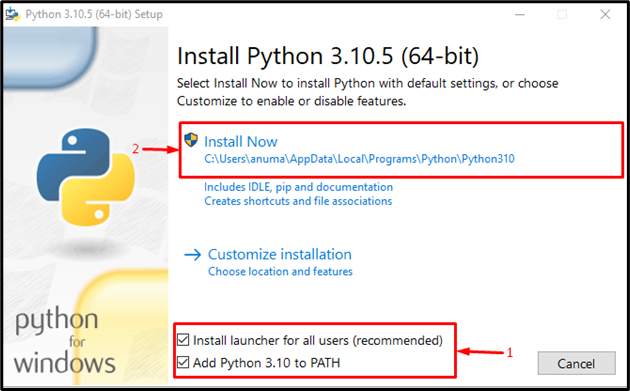
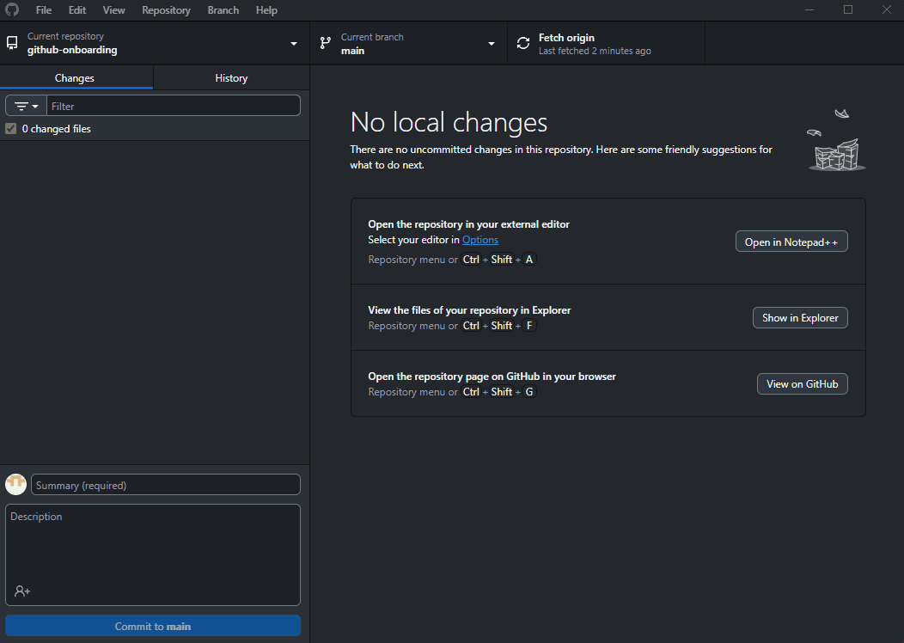
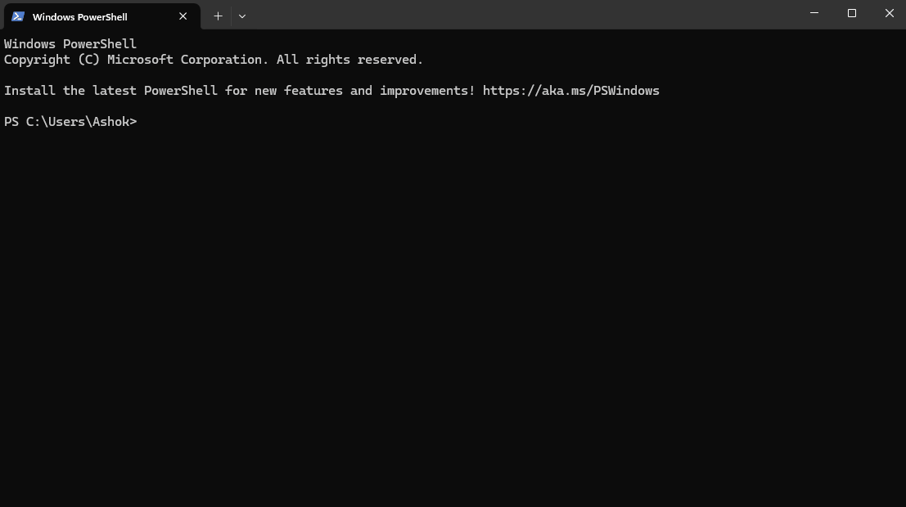

## Welcome to EDGI's GitHub onboarding!
If you're looking to check out projects that are set up to run on your computer (as opposed to just online), then please complete this onboarding before doing so.

This tutorial will help you understand how Git works, and how you can check out and work on any EDGI project yourself!

A prerequisite for this is that you need a GitHub account, and you **must** be part of EDGI's GitHub organization. Reach out to someone if you need help for this! Once this is set up, you can continue with the setup on your computer:

1. **Install Git.** Go to Git's site at https://git-scm.com/downloads, and follow the instructions to install git on your computer.
2. **Install Python.** Go to Python's site at https://www.python.org/downloads/, and install Python on your computer. **Important: When installing, make sure to tick the option to add Python to the PATH.** This will ensure that when you use python commands from your computer's terminal, it will work properly.

3. **Install GitHub Desktop.** Go to GitHub Desktop's site at https://desktop.github.com/download/ and install it. This program makes it easy to look at all the repositories you've installed.
4. Open GitHub Desktop and connect your GitHub account to it. Once you're logged in, hit File -> Clone Repository. Copy the URL for this repository and paste it into GitHub Desktop, make sure it's cloning to a place you like on your computer, and hit Clone! **Important: Try to avoid cloning to a cloud folder - in many cases the "default" folder GitHub chooses is inside another cloud provider's service, like OneDrive or iCloud. This can cause headaches with syncing your repository's contents between different PCs.**
5. Git has a system called **branching** - this will be essential for working on shared projects. Whether you intend to contribute to the project by making changes, or if you want to just mess around with the project on your own copy of it, you'll need to **make a new branch**. To do this, go to GitHub Desktop and hit the *Current branch* button at the top, which should be on the "main" branch by default. Enter your new branch name - for this onboarding, name it "onboarding-yourname". Click *New Branch*, ensure it's creating the branch off of the main repository, and click *Create Branch*. Finally, click *Publish Branch* on the top bar. Now, you have created your own playground of the project, which you can modify as you like without worrying about changing the main branch!

6. Now that you're ready to finally make changes to the project, open PowerShell (or Terminal if you're a Mac user). Use the "cd" command ("change directory") to move to your "github-onboarding" folder, i.e. where this repository is located on your computer. We'll be operating from this same terminal for the rest of the tutorial - don't close it!

7. We can now begin to create a "virtual Python environment" in this location for your project work. **You'll need to do this for every repository you work with if the project uses python for code**. To do this, enter "python -m venv venv" (or, "python3 -m venv venv").
    - Creating a new virtual environment for each project keeps all the tools and libraries that project needs separate, so different projects don’t “step on each other’s toes” with conflicting versions, making your work more reliable and easier to manage. The downside is that your computer now has to know which version of python to use - the globally installed one that is default for all users, or the new "virtual" one that's specific for this project.
8. Now that you have a virtual environment set up for your project, we need to tell the computer to use this virtual environment for running the python code. This is called **activating the environment**. To do this, simply enter ".\venv\Scripts\Activate.ps1" for Windows, or "source venv/bin/activate" for Mac (more details [here](https://docs.python.org/3/library/venv.html#how-venvs-work) if you run into trouble). From now on, all our pip installations will happen in this virtual environment, i.e. specifically for this project.
9. Now, enter "pip install -r requirements.txt" or "pip3 install -r requirements.txt" (If one doesn't work, try the other).
10. To run the onboarding.ipynb notebook, we need to install one last package called jupyter. To do this, enter "pip install jupyter".
11. Now, enter "jupyter notebook", and it should open up a page on your browser. This browser page is actually just showing your local files in a fancy way that will allow you to actually interact with the notebook just like you would with Google Colab. Simply open the onboarding.ipynb file, and continue the onboarding there.